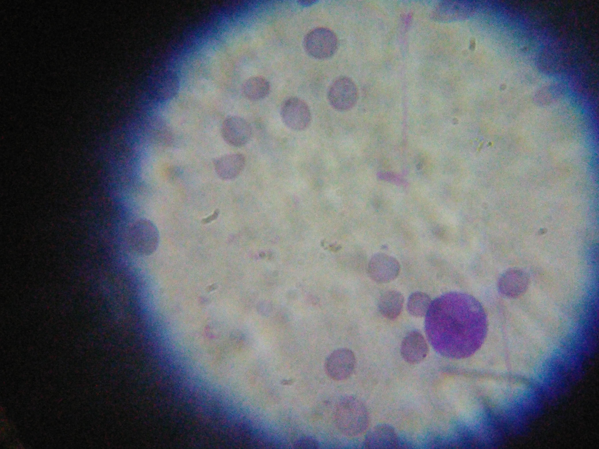
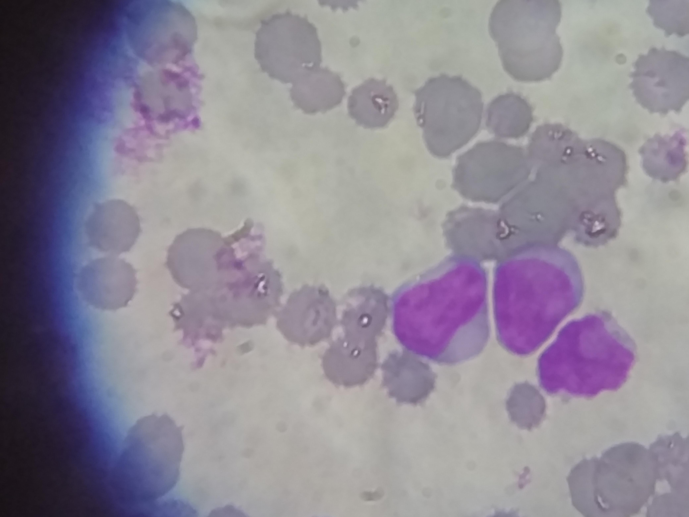
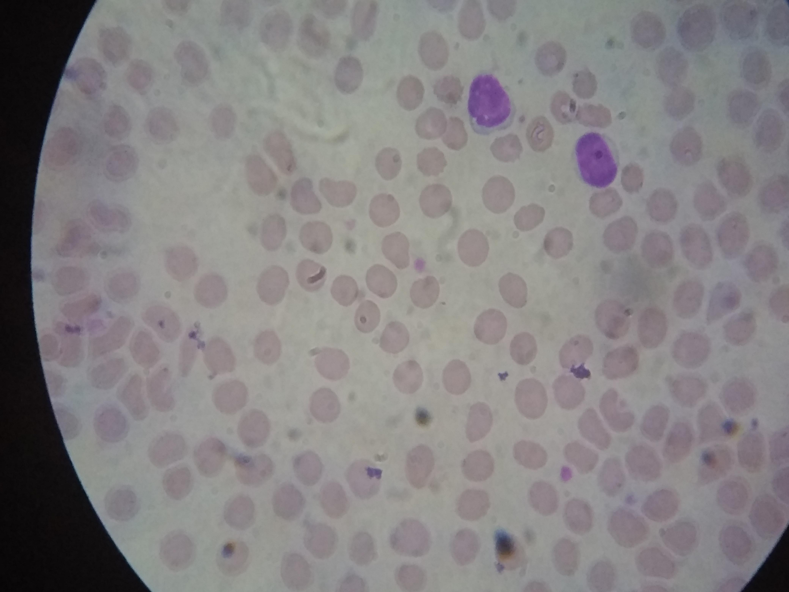
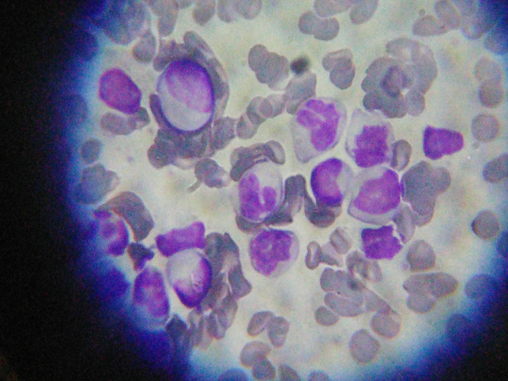
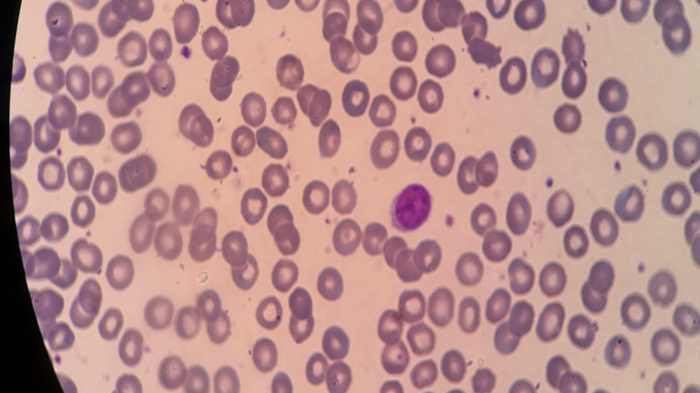

# Leukemia Image Classification

This project focuses on building a deep learning model to classify different types of leukemia from blood cell images. It includes a robust image preprocessing pipeline to enhance image features, which is a critical step for improving model accuracy.

## Dataset

The project uses a dataset of blood cell images categorized into four types of leukemia and one category for healthy cells.

### Classes and Samples

| Class | Description                  | Sample Image                                     |
| :---: | :--------------------------- | :----------------------------------------------- |
| `ALL` | Acute Lymphoblastic Leukemia |       |
| `AML` | Acute Myeloid Leukemia       |       |
| `CLL` | Chronic Lymphocytic Leukemia |       |
| `CML` | Chronic Myeloid Leukemia     |       |
| `H`   | Healthy                      |         |

## Image Preprocessing Pipeline

To enhance the quality of the images and improve model performance, a two-step preprocessing pipeline is applied:

1.  **Denoising (Non-Local Means)**: This step reduces noise in the images while preserving key features like cell edges and textures.
2.  **Contrast Enhancement (CLAHE)**: Contrast Limited Adaptive Histogram Equalization (CLAHE) is applied to the denoised image to improve local contrast and make cellular details more prominent.

The effects of this pipeline are visualized in the `image_preprocessing.ipynb` notebook.

## Project Structure

```
Leukemia-Image-Classification/
├── dataSamples/              # Contains sample images for each class
│   ├── ALL.jpg
│   ├── AML.jpg
│   ├── CLL.jpg
│   ├── CML.jpg
│   └── H.jpg
├── models/                   # Directory to save trained model files
├── utils/                    # Utility scripts (e.g., preprocessing functions)
│   └── preprocessing.py
├── image_preprocessing.ipynb # Notebook for data loading and preprocessing visualization
├── Model.ipynb               # Notebook for building and training the classification model
└── README.md                 # Project documentation
```
